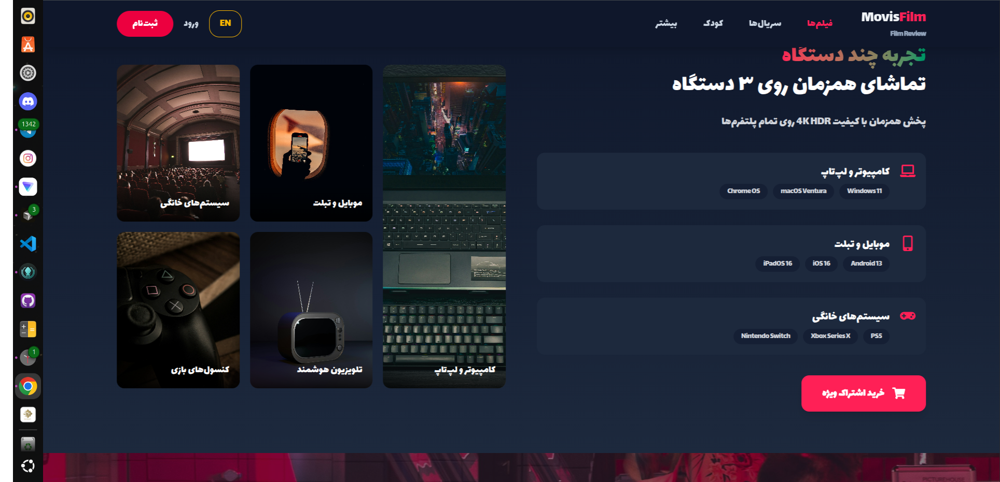
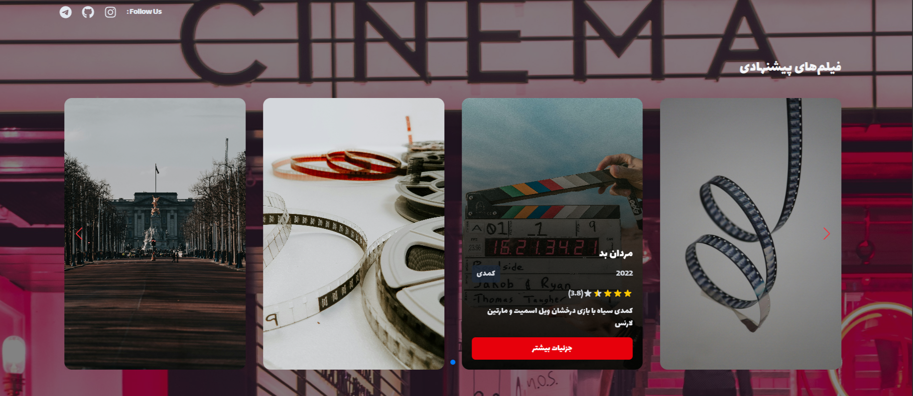

## Movie – Modern Movie Streaming UI 🎬

[English](#english) | [فارسی](#persian)

<div align="center">

  

  <br /><br />

  

</div>

---

## English

### Overview
Movie is a modern, Netflix‑style movie and TV streaming UI built with **React**, **Vite**, **Tailwind CSS 4**, and **PWA** support.  
It focuses on clean UX, fast performance, and full Farsi (RTL) support, making it a great portfolio‑ready front‑end project.

### Key Features
- **Modern landing page** with hero section, categories, highlights, and call‑to‑action
- **Kids profile experience** with a safe and colorful UI for children
- **Movie & series sections** with sliders and cards using Swiper
- **Admin area** (login + simple dashboard) for managing content
- **Responsive design** optimized for desktop, tablet, and mobile
- **PWA ready** – installable, offline‑friendly experience
- **Full RTL support** for Persian, with custom `Lalezar` font integration

### Tech Stack
- **React 19**
- **Vite 6**
- **Tailwind CSS 4 (@tailwindcss/vite)**
- **React Router DOM 7**
- **Swiper**
- **Axios**
- **React Icons**
- **vite-plugin-pwa**

### Getting Started

#### Prerequisites
- Node.js (LTS recommended)
- npm

#### Installation
```bash
# 1. Clone the repository
git clone https://github.com/darkcode-it/Movie.git

# 2. Go into the project directory
cd Movie

# 3. Install dependencies
npm install

# 4. Start the dev server
npm run dev
```

#### Production Build
```bash
# Build for production
npm run build

# Preview the production build
npm run preview
```

### Scripts
- **`npm run dev`** – start development server
- **`npm run build`** – build for production
- **`npm run preview`** – preview production build
- **`npm run lint`** – run ESLint
- **`npm run deploy`** – deploy to GitHub Pages

### Live Demo
- **GitHub Pages**: [Movie App](https://movie-nu-seven.vercel.app)
- **Vercel**: *(add your Vercel URL here)*

---

## Persian

### معرفی پروژه
Movie یک رابط کاربری مدرن و شبیه نتفلیکس برای تماشای فیلم و سریال است که با **React**, **Vite**, **Tailwind CSS 4** و **PWA** ساخته شده.  
تمرکز این پروژه روی تجربه کاربری جذاب، عملکرد سریع، و پشتیبانی کامل از زبان فارسی و راست‌چین (RTL) است.

### ویژگی‌ها
- **صفحه اصلی جذاب** همراه با هیرو، بخش دسته‌بندی‌ها، اسلایدرها و پیشنهاد فیلم
- **محیط مخصوص کودکان (Kids Profile)** با طراحی رنگی و امن برای بچه‌ها
- **بخش‌های فیلم و سریال** با کارت‌ها و اسلایدرهای حرفه‌ای (Swiper)
- **پنل ساده ادمین** (ورود ادمین و داشبورد سبک برای مدیریت محتوا)
- **طراحی واکنش‌گرا** برای دسکتاپ، تبلت و موبایل
- **PWA** – امکان نصب روی دستگاه و تجربه نزدیک به اپلیکیشن
- **فونت فارسی اختصاصی (Lalezar)** و پشتیبانی کامل از RTL

### تکنولوژی‌ها
- **React 19**
- **Vite 6**
- **Tailwind CSS 4**
- **React Router DOM 7**
- **Swiper**
- **Axios**
- **React Icons**
- **vite-plugin-pwa**

### شروع به کار

#### پیش‌نیازها
- Node.js (ترجیحاً نسخه LTS)
- npm

#### نصب و اجرا
```bash
# ۱. کلون کردن مخزن
git clone https://github.com/darkcode-it/Movie.git

# ۲. ورود به پوشه پروژه
cd Movie

# ۳. نصب وابستگی‌ها
npm install

# ۴. اجرای حالت توسعه
npm run dev
```

#### ساخت نسخه نهایی
```bash
# ساخت نسخه تولید
npm run build

# پیش‌نمایش نسخه تولید
npm run preview
```

### اسکریپت‌ها
- **`npm run dev`** – اجرای سرور توسعه
- **`npm run build`** – ساخت نسخه تولید
- **`npm run preview`** – پیش‌نمایش نسخه تولید
- **`npm run lint`** – اجرای ESLint
- **`npm run deploy`** – استقرار روی GitHub Pages

### نسخه زنده
- **GitHub Pages**: [Movie App](https://movie-nu-seven.vercel.app)
- **Vercel**: *(آدرس دیپلوی روی Vercel را اینجا قرار دهید)*
